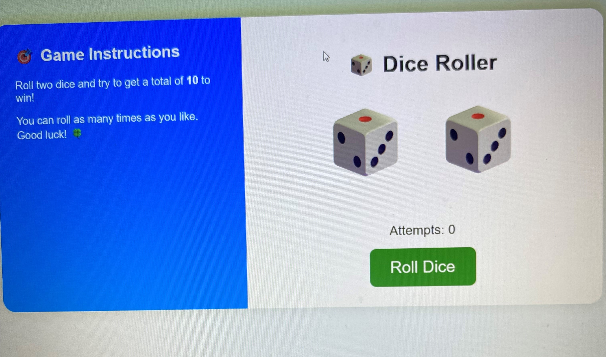

🎲 Dice Roller Game

A simple and fun web-based dice game built using HTML, CSS, and JavaScript.

## 🕹️ How to Play

- Click the **"Roll Dice"** button to roll **two dice**.
- Your goal is to get a total of **10** to win.
- Every roll counts as one attempt.
- No limit on attempts — keep playing and enjoy!

## 🚀 Features

- 🎲 Two dice rolled on each turn.
- 🔊 Sound effect plays on roll.
- 🟢 Win message appears when total is 10.
- 📊 Attempt counter tracks number of rolls.
- 📝 Clear instructions displayed beside the game.
- 🎨 Clean and responsive design.

## 📁 Project Files

- `index.html` – Game layout and structure
- `style.css` – Styling and layout
- `script.js` – Dice rolling logic
- `dice-roll.mp3` – Dice roll sound
- `screenshot.png` – Game screenshot (optional)

## 💻 How to Use

1. Download or clone this repository.
2. Open `index.html` in your web browser.
3. Click **Roll Dice** to play!

## 📸 Screenshot

## 🧑‍💻 Author

Built with ❤️ using vanilla HTML, CSS, and JavaScript.
